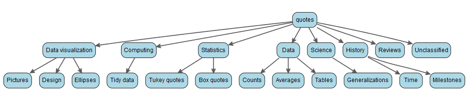
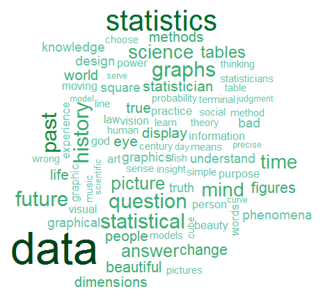

[](http://www.repostatus.org/#active) 
[](https://travis-ci.org/friendly/statquotes) [](http://www.r-pkg.org/pkg/statquotes) 
[](http://www.rdocumentation.org/packages/statquotes)

# statquotes v. 0.2.3
**Quotes on statistics, data visualization and science**

This package displays a randomly chosen quotation from a data base consisting
of quotes about topics related to statistics, data visualization and science.
The original idea came from the Unix `fortune` program that first appeared
in Version 7 Unix. The \pkg{fortune} package is an R-centric equivalent.
\pkg{statquotes} is dedicated to quotations on the substance of data
analysis and visualization.

The data base is a collection of quotations assembled over the years from various
sources.  It began life as a simple text file and was later converted to
`LaTeX`  using the `epigraph` package. The quotes are classified by general topics (and subtopics).

In this R package, each call to `statquote()` displays a randomly selected quotation.
The selection can be restricted to those whose `topic` field matches the `topic=`
argument.

The main topics of the quotes are:

```{r}
> levels(quotes$topic)
[1] "Computing"          "Data"               "Data visualization" "History"           
[5] "Reviews"            "Science"            "Statistics"         "Unclassified"      
```

Some of these are divided into subtopics, most conveniently shown in tree form (using the [`data.tree`](https://cran.r-project.org/package=pkgname) package)



### Examples

```{r}
> set.seed(761)
> statquote()

The best thing about being a statistician is that you get to play in everyone's backyard. 
--- John W. Tukey 
> statquote(topic="science")

Some people weave burlap into the fabric of our lives, and some weave gold thread. Both contribute 
to make the whole picture beautiful and unique. 
--- Anon. 
> search_quotes("mail")

Have you ever seen voice mail?
--- The Hackers Test
```

```{r}
quote_cloud()
```



### Installation

This package is now on CRAN.  It can be installed from there via

```
install.packages("statquotes")
```
The development version (if any) can be installed from this repo on Github via
```
devtools::install_github("friendly/statquotes")
```

### Author

Michael Friendly  
Phil Chalmers  
Matthew Sigal


### License

GPL (>= 2)
