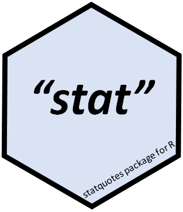

<!-- badges: start -->

[](https://CRAN.R-project.org/package=statquotes)
[](https://cran.r-project.org/package=statquotes)
[](http://www.repostatus.org/#active) 
[](https://cran.r-project.org/package=statquotes)
[](https://travis-ci.org/friendly/statquotes) 
[](https://github.com/friendly/statquotes)

<!-- badges: end -->


# statquotes v. 0.2.6 
**Quotes on statistics, data visualization and science**

This package displays a randomly chosen quotation from a database consisting of quotes about topics related to statistics, data visualization and science.  The original idea came from the Unix `fortune` program that first appeared in Version 7 Unix. The `fortune` package is an R-centric equivalent.  `statquotes` is dedicated to quotations on the substance of data analysis and visualization.

The data base is a collection of quotations assembled over the years from various
sources.  It began life as a simple text file and was later converted to
`LaTeX` using the [`epigraph` package](https://ctan.org/pkg/epigraph?lang=en). 

In this R package, each call to `statquote()` displays a randomly selected quotation.  The selection can be restricted to those whose `tags` field matches the `tag` argument, or whose `source` field matches the `source=` argument.

### Examples

#### Searching and printing

The default print method gives a plain text format for the console, in the style of `fortune()`.

```{r}
> set.seed(761)
> statquote()

The best thing about being a statistician is that you get to play in everyone's backyard. 
--- John W. Tukey 

> statquote(tag="science")

Some people weave burlap into the fabric of our lives, and some weave gold thread. Both contribute 
to make the whole picture beautiful and unique. 
--- Anon. 

> search_quotes("mail")

Have you ever seen voice mail?
--- The Hackers Test
```

#### Other output formats

`as.markdown()` formats quotes for `markdown`
```{r}
as.markdown(statquote())
```
> *The devil is in the details.* -- George Schultz

`as.latex()` formats quotes for LaTeX, designed for the [epigraph](https://ctan.org/pkg/epigraph) package

```{r}
cat(as.latex(statquote()))
\epigraph{The future is uncertain but the end is always near.}{Jim Morrison}
```
#### Quote clouds

`quote_cloud()` generates word clouds based upon a search of the quotes database.
```{r}
quote_cloud()
```


### Installation

The released CRAN version can be installed via:

```
install.packages("statquotes")
```
The development version (if any) can be installed from this repo on Github via:
```
devtools::install_github("friendly/statquotes")
```

#### Quote of the day

To have `statquotes` give you an inspirational quote of the day each time you start R, include the following line in your
`.Rprofile` file.

```
if(interactive()) statquotes::statquote()
```

### Author

Michael Friendly
Phil Chalmers
Matthew Sigal
Kevin Wright


### License

GPL (>= 2)
