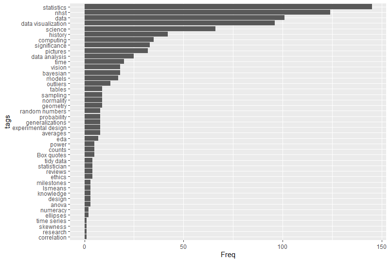

<!-- badges: start -->

[](https://CRAN.R-project.org/package=statquotes)
[](https://cran.r-project.org/package=statquotes)
[](http://www.repostatus.org/#active) 
[](https://cran.r-project.org/package=statquotes)
[](https://travis-ci.org/friendly/statquotes) 
[](https://github.com/friendly/statquotes)

<!-- badges: end -->


# statquotes v. 0.3.2 
**Quotes on statistics, data visualization and science**

This package displays a randomly chosen quotation about topics related to statistics, data visualization and science, or can be used to search for quotes within the statquotes database for key term tags or authors.

The original idea came from the Unix [`fortune`](https://en.wikipedia.org/wiki/Fortune_(Unix)) program, used to display a "fortune" at startup and contained some bits of wisdom, together with obscure jokes about computer science and computer programming.

The [`fortunes`](https://cran.r-project.org/package=fortunes) 
package is focused on quotes about R, largely gleaned from the [R-help](https://stat.ethz.ch/mailman/listinfo/r-help) mailing list, and
collected in a [vignette](https://cran.r-project.org/web/packages/fortunes/vignettes/fortunes.pdf).

The `statquotes` package is focused on quotes about data analysis, visualization and science. It can be used to find quotes when writing about these topics.

In this R package, each call to `statquote()` displays a randomly selected quotation, or, via `search_quotes()` restricted to those whose `tags` field matches the `tag` argument, or whose `source` field matches the `source=` argument. Quotes can be displayed in the R console, or formatted as markdown or LaTeX (for use with the [epigraph](https://ctan.org/pkg/epigraph) package).

### Installation

The released CRAN version can be installed via:

```
install.packages("statquotes")
```

The development version can be installed via:
```
devtools::install_github("friendly/statquotes")
```

Please report any problems or bugs at https://github.com/friendly/statquotes/issues.

### Examples

```{r}
> library(statquotes)
> statquote()

The best thing about being a statistician is that you get to play in everyone's backyard. 
--- John W. Tukey 

R> statquote("boggle") # or statquote(pattern="boggle")

The statistician has no magic touch by which he may come in at the stage of
tabulation and make something of nothing. Neither will his advice, however wise in
the early stages of a study, ensure successful execution and conclusion. Many a
study, launched on the ways of elegant statistical design, later boggled in
execution, ends up with results to which the theory of probability can contribute
little.
--- W. Edwards Deming

R> statquote(source="Tukey") # Choose a random quote from a specific author

Whatever the data, we can try to gain understanding by straightening or by flattening. When we
succeed in doing one or both, we almost always see more clearly what is going on.
--- John Tukey

# quote_tags() # list all tags

R> statquote(tag="numeracy") # choose a random quote with a specific tag

To be numerate means to be competent, confident, and comfortable with one’s judgements on whether
to use mathematics in a particular situation and if so, what mathematics to use, how to do it,
what degree of accuracy is appropriate, and what the answer means in relation to the context.
--- Diana Coben

# To find all quotes with a particular word:
> search_quotes("lsmeans")

```

### Output formats

Quotes have class `statquote`. The `print.statquote()` method gives a plain text format for the console.
```
R> statquote("eulogy")

One is so much less than two. [John Tukey's eulogy of his wife.]
--- John Tukey
```

Use `as.markdown()` for markdown-formatted quotes:

```{r}
R> cat(as.markdown(statquote("eulogy")))
> *One is so much less than two. [John Tukey's eulogy of his wife.]* -- John Tukey
```

Use `as.latex()` for Latex-formatted quotes (for the [epigraph](https://ctan.org/pkg/epigraph) package):

```{r}
R> cat(as.latex(statquote("eulogy")))
\epigraph{One is so much less than two. [John Tukey's eulogy of his wife.]}{John Tukey}
```

Use `as.data.frame()` to see unformatted quotes:
```{r}
R> as.data.frame(statquote("eulogy"))
    qid                                                             text     source
411 411 One is so much less than two. [John Tukey's eulogy of his wife.] John Tukey
                                                                                                        cite
411 The life and professional contributions of John W. Tukey, The Annals of Statistics, 2001, Vol 30, p. 46.
     url       tags  tex
411 <NA> statistics <NA>
```

#### Tags

One or more keyword `tags` are used to classify quotes in the quotes database. These provide another means of searching. The code below produces a bar plot of tags, sorted by frequency.

```{r}
library(ggplot2)
qt <- quote_tags(table=TRUE)
qtdf <-as.data.frame(qt)
# Sort tags by frequency
qtdf |>
  dplyr::mutate(tags = forcats::fct_reorder(tags, Freq)) |>
  ggplot2::ggplot(aes(x=Freq, y=tags)) +
  geom_bar(stat = "identity")

```



#### Quote clouds

`quote_cloud()` generates a word cloud based upon a search of the quotes database.
```{r}
#quote_cloud("bayes")
quote_cloud()
```


#### Quote of the day

To have `statquotes` give you an inspirational quote of the day each time you start R, edit your `.Rprofile` file:
```
# Edit .Rprofile in home directory
file.edit(file.path("~", ".Rprofile"))
```
Add this line to the bottom of `.Rprofile`, then save and close `.Rprofile`.
```
if(interactive()) statquotes::statquote()
```

### Authors

Michael Friendly,
Kevin Wright,
Phil Chalmers,
Matthew Sigal


### License

GPL (>= 2)
